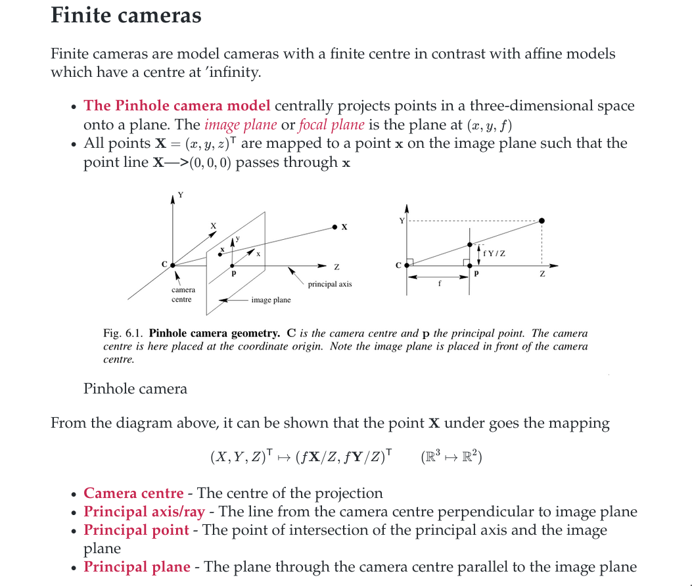

# vwc
Shell script for compiling vimwiki notes to pdf/html with pandoc

## USAGE:

    vwc [all|category|"*.md"]

## EXAMPLES:

    vwc all
      compiles all in $WIKI_PATH
    vwc some-arcane-topic.md
      compiles some-arcane-topic.md
    vwc category
      1) $WIKI_PATH/academics
      2) $WIKI_PATH/coding
      3) $WIKI_PATH/diary
      4) $WIKI_PATH/cheats
      5) $WIKI_PATH/books
      #? 2

      compiles notes in 2)

## Dependencies
* Pandoc
* LaTeX

## Explanation
This script is mostly based on [Conner McDaniel](https://github.com/connermcd)'s notes script.
If the The directory structure looks like

    /home/lynx/Dropbox/wiki
    ├── academics
    │  ├── group-theory
    │  ├── index.md
    │  ├── quantum-mechanics
    │  ├── ...
    ├── assets
    │  ├── fonts
    │  ├── fonts.tex
    │  └── markdown.css
    ├── books
    │  ├── antifragile.md
    │  ├── fooled-by-randomness.md
    │  ├── index.md
    │  └── ...
    ├── ...
    └── index.md

Images and other assets stored in the ``assets`` of each corresponding notes directory.

## Vim/Fish integration
    command! -bang -nargs=1 Vwc execute ':!vwc '.<q-args>
    command! -bang -nargs=* Notes call fzf#vim#grep("find $WIKI_PATH -iname \"*.md\" 
          \| xargs rg --column --line-number --no-heading --color=always --smart-case -- ".shellescape(<q-args>), 1, <bang>0)
    nnoremap <leader>[ :Vwc 
    nnoremap <leader>] :Vwc %:p <CR>

Also fuzzy search through notes from the command line

    function notes
      nvim -c "Notes $args"
    end

## Sample

